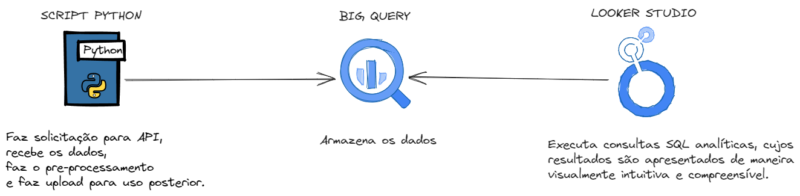
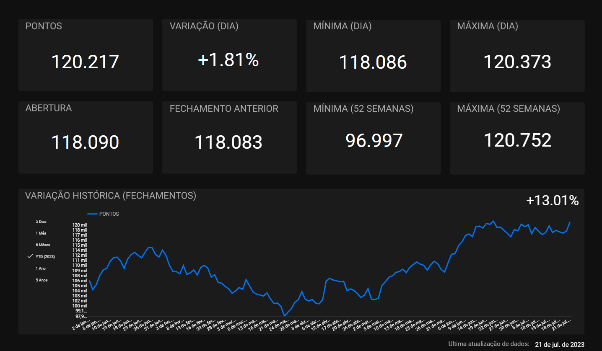

## Objetivo
A respeito do ibovespa, que é o principal índice de ações da Bolsa de Valores de São Paulo (B3) e representa o desempenho médio das ações das empresas mais negociadas no mercado de ações brasileiro. Construir uma aplicação de dados completa, que seja possível analisar indicadores prontos e a variação histórica ao longo de 5 anos retroativos.

## Resumo geral do projeto 
<b>Resumo:</b>

  
  <b>Fluxo de processo</b>

O processo tem início com um script Python que realiza uma solicitação HTTP para acessar dados em uma [API](https://brapi.dev/). Os dados obtidos são submetidos a um pré-processamento e, posteriormente, são carregados no BigQuery, onde são armazenados. O Looker Studio então utiliza consultas personalizadas no BigQuery, as quais fazem um ETL nos dados em tempo de processamento e retorna modelados de acordo com os padrões de visualização ideais definidos para o projeto, Figma foi utilizado para fazer o background da visualuização.

## Stacks
Python (json, pandas, google.cloud.bigquery, os, MIMEMultipart, MIMEText, smtplib, requests, pandas_gbq, google.oauth2.service_account, platform) 
Big Query - GCP 
Looker Studio - GCP 
Figma

## Resultados
Com a aplicação de inteligência de dados nas consultas SQL estruturadas, torna-se viável a implementação de filtros para períodos específicos, conforme concebidos no projeto, como os últimos 5 dias ou o YTD (Year to Date). Sem essa inteligência aplicada aos dados, a realização desses filtros de maneira nativa no Looker Studio não seria possível.

  
  <b>Dashboard final</b>

O código Python, as consultas SQL estruturadas e o design de background criado no Figma estão disponíveis nos arquivos do repositório. Além disso, você pode acessar a dashboard final por meio do seguinte link:
https://lookerstudio.google.com/reporting/1a270ffa-d6ed-44d7-9b60-b2eb862f10ce

Vale ressaltar que a atualização de dados não está habilitada, uma vez que se trata de um projeto de cunho pessoal e destinado ao portfólio. Os dados disponíveis correspondem à última execução do script Python, e, com essa consideração em mente, foi adicionada à dashboard a informação referente à data da última atualização.

## Conclusão
Por meio da aplicação de diversas tecnologias e conceitos técnicos, este projeto ilustra um pouco da minha habilidade em aplicar inteligência de dados para uma análise mais eficiente do índice Ibovespa. Estou confiante de que alcancei um resultado satisfatório, cumprindo o objetivo inicialmente estabelecido. Espero que este projeto contribua para a disseminação do conhecimento, e estou à disposição para esclarecer quaisquer dúvidas que possam surgir.
